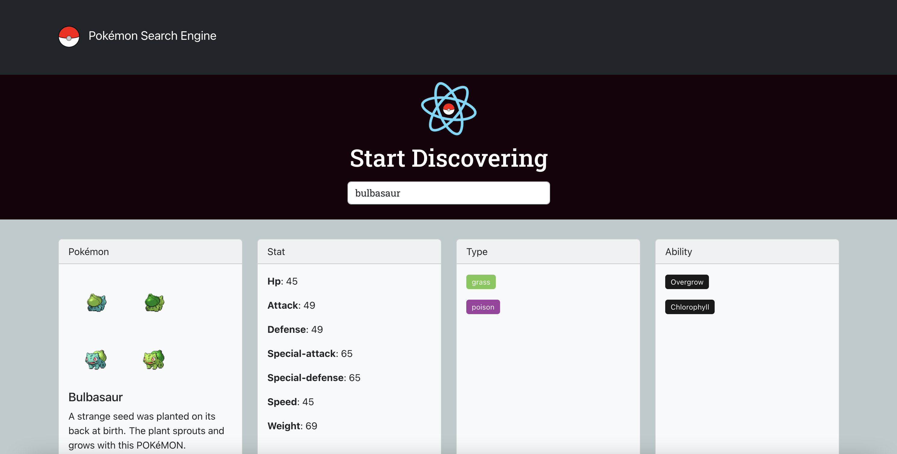

# Pokémon Search Engine

## Description

This project was bootstrapped with [Create React App](https://github.com/facebook/create-react-app). This application allows
users to search for Pokémon. Created using [PokéAPI](https://pokeapi.co/).

## Technology Stack

## Screenshot

## Deployed page

[View Published Page](https://erin-m-keller.github.io/keller-pokemon/)

## License

[MIT](https://choosealicense.com/licenses/mit/)